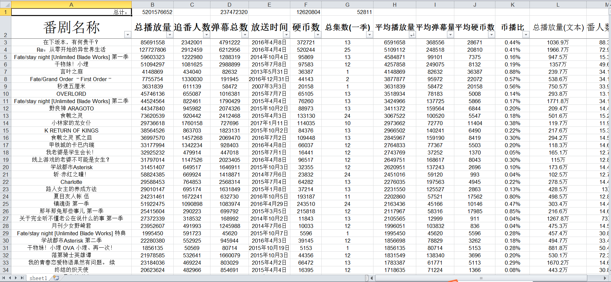

# Bilibili scrapy

> A tool to scrapy data from bilibili.com based on scrapy.
> 一个用来爬取B站数据的爬虫，基于scrapy.
## Overview


## 功能
* 目前只能爬取所有B站仍登记的官方番剧，大概有2700+
* 可爬取的数据有 
  * 番剧名称
  * 番剧的B站页面URL
  * 上映时间
  * 总播放量
  * 追番人数
  * 弹幕总数
  * 番剧集数
  * 硬币数
  * 各种平均数据
  * 币播比

## Get and Run

* You should install library scrapy.
* clone or download the responsity from github.
* cd the dictory,and type ```scrapy crawl s1```
* the data will be a json file named items.json

***

* 你需要安装 ```scrapy``` 这个爬虫框架库，windows安装比较麻烦,具体google一下.
* 克隆或者下载这个库到本地.
* 切换到库的目录，运行命令 ```scrapy crawl s1```
* 数据保存在名为 items.json 的json文件。
  * PS : 添加了工具 data.py
  * 你可以使用 data.py 将生成的 items.json 转换为 excel 表格方便查看,效果参照 preview


